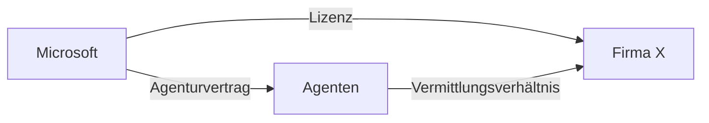

# CYSECO

## Administratives

### Bewertung

-   49%: eingereichte schriftliche Arbeit mit allen 5 Übungen (Gruppennote)
-   51%: 40 minütige, schriftliche Abschlussprüfung

### Termine

???+ abstract "Termine"

    - [x] 07\. März: MS Coaching
    - [x] 13\. März: Abgabe Management Summary
    - [ ] 28\. März: Abgabe Mängelrüge
    - [ ] 18\. April: Abgabe Vulnerability Report
    - [ ] 02\. Mai: Abgabe DSG Vorfall
    - [ ] 16\. Mai: Abgabe Pressemitteilung

## Inhalt

### Wann Pressemitteilung?

-   etwas sehr wichtiges (z.B. Unternehmung aufkaufen)
-   revolutionierendes Produkt veröffentlichen

### Management Summary

Das Management Summary (Executive Summary) beschreibt eine Kurzbeschreibung eines längeren Berichts.
Damit hat man "Macht" um den Leser zu beinflussen, was man ihn wissen lassen will, wenn er nicht die ganze Arbeit liest.  
Es ist der erste Eindruck der Arbeit -> quasi das Einzige was zählt.

??? abstract "Beim Schreiben beachten"

    * Warum wurde diese Arbeit geschrieben?
    * Was will die Arbeit erreichen?
    * Was ist herausgekommen?
    * Welches sind die Eckpunkte der Methodik? (Hat man 7 Experten befragt oder 500 Fragebögen ausgewertet)
    * Methodik nach Resultaten präsentieren
    * Form - Füllwörter auslassen.
    * Kurz - ideal eine Seite lang.
    * Resultate sollten den Hauptteil darstellen lassen.
    * Fette Wörter vermeiden
    * Unterteilungen / Absätze machen
    * MAX 2 A4 SEITEN!
    * Vorgehen
        1. Text lesen
        2. Inhalt gedanklich rekapitulieren
        3. Text nochmals lesen, relevante Wörter oder Wortgruppen markieren
        4. Kernaussagen, die an die Kernwörter gebunden sind, in (eigenen) Worten
        festhalten
        5. Die Kernaussagen verknüpfen und so die Zusammenfassung des Textes bilden.
        6. Basissatz voranstellen
    * Typische Fehler
        1. Fachjargon
        2. Einzelne Punkte zu detailliert
        3. Es braucht weitere Dokumente statt vollständige Übersicht
        4. Kein Korrekturlesen

-   Ist das MS zu kurz kann die Fehlerquote zu hoch sein / zu Missverständnissen führen.

#### Übung MS

-   Ist das MS zu kurz kann die Fehlerquote zu hoch sein / zu Missverständnissen führen.

### Vorgehen bei nicht zufriedenstellenden Situationen (Mängelrüge)

1. Ausgangslage
2. Vertrag qualifizieren
3. Problem erfassen
4. Kommunikationsmittel wählen
5. Schreiben aufsetzen
6. Weiteres Vorgehen

#### Ausgangslage

-   Was wurde im Vertrag definierte
-   Was liegt (nicht) vor?
-   Was hätte wann und wie geleistet werden sollen

-> immer W-Fragen stellen

#### Vertrag qualifizieren

Was für ein Vertrag liegt vor?

-   Kaufvertrag
-   Arbeitsvertrag
-   Werkvertrag
-   Einfacher Auftrag
-   Agenturvertrag
-   Leasing
-   Lizenz

Wenn die Leistung nicht vorliegt, ist das Geld nicht geschuldet.

##### Agenturvertrag

Microsoft -> Agenten (Agenturvertrag)  
Firma X <-> Microsoft (Lizenz)
Agenten -> Firma X (Vermittlungsverhältnis)

##### Verträge

-   Nutzt Raum für 300.-: Mietvertrag
-   Einkaufen für Grossmutter: einfacher Auftrag
-   Laptop Kollegin übers Wochenende überlassen: Gebrauchsleihe
-   100.- an Kolleg mit Hoffnung auf Rückgabe: Darlehen
-   Deine Firma überlässt anderen Firmen Software von Microsoft: Lizenzvertrag
-   Garagist meint, dass Autofahren mit einer Finanzierung günstig ist: Leasing
-   McDonalds: Franchising

#### Problem erfassen

-   Das **was** definieren
-   Erfüllung / Nichterfüllung / Schlechterfüllung

#### Kommunikationsmittel wählen

-   Wer ein Recht geltend machen will, muss den Beweis erbringen.
    -   Für alle formlosen Verträge (Art. 11) ist Textkommunikation (zB E-Mail) zulässig (schwierig nachzuweisen, dass E-Mail erhalten/gelesen wurde).
    -   Präsentationen, Protokolle und Traktandenlisten können helfen ein Verhältnis zu klären.
    -   Elektronische Kopien sind zugelassen.
-   **Gestaltungsrechte**

Mängel müssen detailliert nach 2 Tagen vorliegen.

#### Sachverhalt Gemüsegrossmarkt

Vorgehen:

-   Erfassen der Ausgangslage
-   Aufgabe umfasst folgendes:
    -   Gemäss Prüfschema durchgehen (Welche Art von Vertrag liegt vor?)
    -   Schreiben aufsetzen
    -   Wie gross sind die Chancen auf eine Rückerstattung?
-   Coaching Termin gem. Liste
-   Abgabe von maximal 4 Seiten an andrehenry.kuhn@hslu.ch
-   Abgabetermin: 28. März

!!!abstract "Beachten"

    - Korrektheit der rechtlichen Ausdrücke
    - Art des Vertrages bestimmen (kein richtig oder falsch, nur gut begründen)
