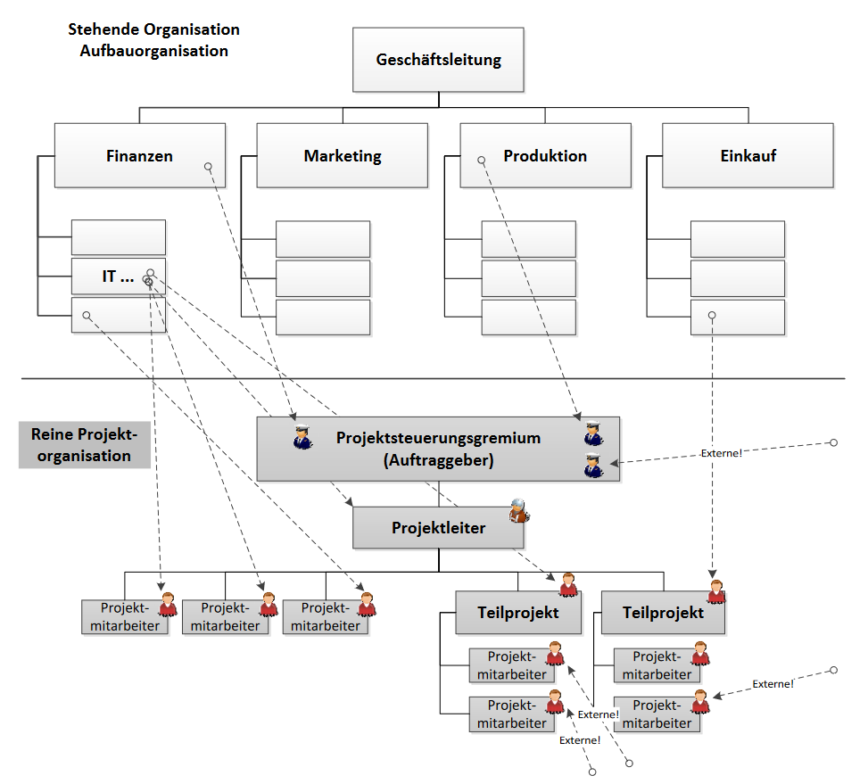
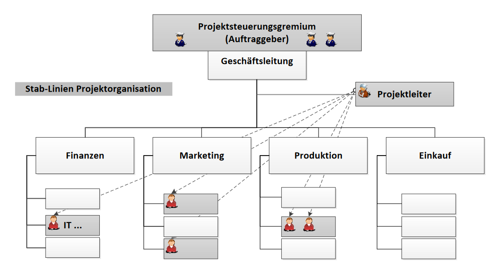
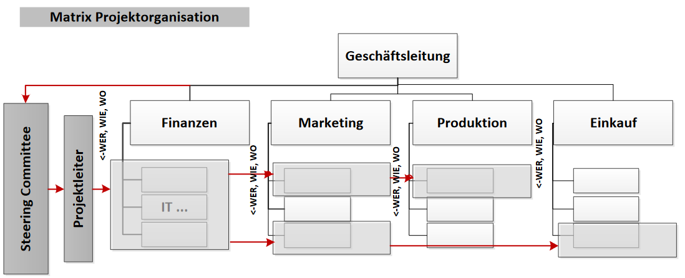

# PMB

## Administratives

### MEP

-   30% Übungen
-   70% 50-70 minütige Prüfung

### Testat

-   MEP Probeprüfung
-   Präsentation

### Literatur

Projektmanagement - Das Wissen für eine erfolgreiche Karriere, Jenny B.

## Inhalt

[Arc42](https://arc42.org)

### Grundlagen

#### Projekte

**Projektcharakter:**

-   hat ein inhaltlich definiertes Ziel
-   hat eine inhaltlich definierte Ausgangslage
-   ist zeitlich abgrenzbar / hat einen definierten Start- und Endzeitpunkt
-   hat einen vorgegebenen Kostenrahmen
-   hat den Charakter der Einmaligkeit
-   ist interdisziplinär
-   Bedarf einer spezifischen Organisation
-   wird methodisch abgewickelt
-   hat einen Komplexitätsgrad; ist kompliziert
-   hat einen Business Case
-   Eine Organisationsform ist temprorär so lange das Projekt exisitiert

**Projekterfolg**:  
Das Projekt gilt als erfolgreich, wenn das Ziel in dem vorgegebenen Zeit- und Kostenrahmen realisiert wurde.

#### Magisches Dreieck

-   Ziet
-   Kosten
-   Leistung

#### Hermes

isch gloub no wichtig

#### Scrum

[Scrum Guid](https://scrumguides.org/docs/scrumguide/v2020/2020-Scrum-Guide-US.pdf)

-   Ist ein Ansatz zur Prozesssteuerung **kein** Projektdurchführungs-Methode, **keine** Projektmanagement-Methode
-   Scrum hat keinen Projektleiter weil Scrum nichts mit Projektmanagement zu tun hat.

Scrum ist ein agiles Rahmenwerk für die Entwicklung, Lieferung und Wartung von Produkten.
Scrum ist ein agiles Rahmenwerk für die Produktentwicklung, das auf einem Team, einem Product Owner, einem Scrum-Master, Sprint-Zyklen und regelmäßigen Ereignissen wie Sprint-Planning, Daily Scrum, Sprint-Review und Sprint-Retrospektive basiert.

**Begriffe:**

1. **Scrum-Team:** Ein selbstorganisiertes Team von 5-9 Personen, das für die Umsetzung des Projekts verantwortlich ist.

2. **Scrum-Master:** Eine Person, die für die Umsetzung von Scrum verantwortlich ist und das Team bei der Anwendung der Scrum-Praktiken unterstützt.

3. **Product Owner:** Eine Person, die für die Definition und Priorisierung der Produktanforderungen verantwortlich ist und eng mit dem Team zusammenarbeitet, um sicherzustellen, dass das Produkt den Kundenbedürfnissen entspricht.

4. **Sprint:** Ein wiederholbares, zeitlich begrenztes Ereignis, das in der Regel 1-4 Wochen dauert und dazu dient, ein fertiges Produktinkrement zu liefern.

5. **Sprint-Planning:** Ein Ereignis, bei dem das Team und der Product Owner den Umfang des nächsten Sprints planen und die Arbeit priorisieren.

6. **Daily Scrum:** Ein tägliches Treffen von 15 Minuten, bei dem das Team den Fortschritt des letzten Tages bespricht, die Arbeit für den heutigen Tag plant und Hindernisse identifiziert.

7. **Sprint-Review:** Ein Ereignis am Ende jedes Sprints, bei dem das Team dem Product Owner und anderen interessierten Parteien das fertige Produktinkrement präsentiert.

8. **Sprint-Retrospektive:** Ein Ereignis, bei dem das Team den letzten Sprint reflektiert und Möglichkeiten zur Verbesserung identifiziert.

### Projektorganisationen

1. Reine Projektorganisation / Linien-Projektorganisation
2. Projektkoordination / Stab-Linien-Projektorganisation
3. Matrix-Projektorganisation
4. Mischformen

#### Linien Projektorganisation

**Projektleiter**

-   Finanzielle Kompetenz
-   Fachliche Kompetenz
-   Disziplinarische Kompetenz
-   Administrative Kompetenz

Volle Verantwortung für Projekterfolg liegt beim PL

#### Stab-Linien-Projektorganisation

**Projektleiter**

-   Koordination
-   hat keine Weisungsbefugnis

**Linie**  
P-Mitarbeiter unterstehen nach wie vor den Linienvorgesetzten (fachlich, disziplinarisch, finanziell, administrativ)

#### Matrix-Projektorganisation

**Projektleiter**

-   regelt das Was, Wann

**Linie / Linienvorgesetzter**

-   regelt das Wer, Wie, Wo, Womit

#### Prüfungsverantwortung

|                                     | disziplinarische Führung | fachliche Führung | finanzielle Führung | administrative Führung |
| ----------------------------------- | :----------------------: | :---------------: | :-----------------: | :--------------------: |
| **Reine Projektorganisation**       |            PL            |        PL         |         PL          |           PL           |
| **Stab-Linien Projektorganisation** |          Linie           |       Linie       |        Linie        |         Linie          |
| **Matrix Projektorganisation**      |                          |                   |                     |                        |

#### Rollen in einem agilen SW-Entwicklungsprojekt

-   **Projektleiter:in**  
    Schlüsselrolle in den frühen Phasen: Roadmap, Organisation, Meilensteine, Releaseplanung, Risikomanagement.  
    Später: Controlling und Reporting
-   **Product Owner**  
    Schlüsselrolle über die ganze Projektlaufzeit: Product Backlog-Pflege & -priorisierung, Spring-Planung & -abnahme
-   **Scrum Master**  
    "servant leader" für das Team und den Product Owner:  
    unterstützt korrektes Vorgehen und stellt die Qualität sicher
-   **Scrum Team**  
    Entwickler:innen, die selbstorganisiert und eigenverantwortlich in den Sprints die Software entwerfen, erstellen und testen

### User stories

-   Titel
-   Beschreibung
    -   We möchte was
    -   Welche Funktionalität
-   Akzeptanzkriterien
    -   Anforderungen umgesetzt?
    -   Beantworten was getestet werden soll
-   ergänzende Beschreibung
    -   Link auf einen Use Case

**Gute User story**:

-   Independent -> unabhängig von anderen Stories
-   Negotiable -> Kunden und Entwickler erarbeiten gemeinsam
-   Valuable -> Liefern einen erkennbaren Mehrwert
-   Estimatable -> überschaubar
-   Small -> Kann zu gross sein
-   Testable -> muss testbar sein

From above: INVEST
