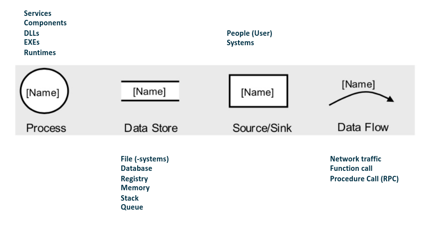
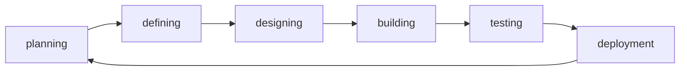

# SPRG

## Administratives

### Templates

-   SW02 s.119

### MEP

-   type of exam TBD

### Testat

-   Threat analysis

### Resources

-   [ISSS](https://www.isss.ch/de/)
-   [SANS](https://www.sans.org)
-   [ISC2](https://www.isc2.org)

## Inhalt

### Data flow diagramm

4 elements:

### Approach

Rule of thumb:

-   the effort spent for RE should be inverse to the risk that your're able to manage

### Requirements

#### What is a requirement?

1. A condtion or capability needed by a user to solve a problem or achieve an objective
2. A condition or capability that must be met or possessed by a system or system component to satisfy a contract, standard, specification, or other formally omposed document
3. A documented representation of a condition or capability as in (1) or (2)

#### Functional / Non-Functional requirements

Non-functional requirements are mostly defined by: without this requirement, the base functionality for the user should still be the same but it isn't as smooth/secure/clean or whatever (luxury functions).

### Core Activities of RE

1. **Elicitation**: optain requirements from stakeholders and other sources, refine the requirements in greater detail
2. **Documentation**: elicited requirements are described adequately
3. **Validation and negitiation**: documented requirements must be validated and negotiated early on
4. **Management:** structure requirements, prepare them so they can be used in many roles.

### Boundaries

#### Exercise - Draw a System

see slides SW02

#### How to "find" requirements?

1. Elicitation
    - Documentation
    - validation and negotiation
2. Management

**Elicitation**:

-   List and analyze stakeholders
    -   Who is the customer?
    -   Who are the users?
    -   Who are the deciders?
    -   External systems or organiztions involved?
    -   Regulatory constraints/requirements?
-   Stakeholder Map

**Stakeholder:**

-   Stakeholders:
    -   Consumers
    -   Buyers
    -   The ones with money
-   Examine the individual needs of the different stakeholders

### Brainstorming technique

6-3-5

-   6 people
-   3 suggestions
-   5 minutes

### Questions

-   open
    -   Was für langfristige Ziele haben sie mit dem Produkt (z.B. Weiterentwicklung, Support für Kunden)
    -   Was würden Sie ändern?
-   closed
    -   Maximales Budget
    -   Dimensionen
    -   Welche Zielgruppe

#### Use case exercise

| Description        | Example           |
| ------------------ | ----------------- |
| Use Case Name      | pour Coffee       |
| Use Cases          | Pour Coffe        |
| System             | Coffee machine    |
| Akteur             | User              |
| Trigger            | Button press      |
| Success Guarantees | Hot coffee in cup |

### Models

#### Waterfall

-   Strict linear
-   simple definition of milestones
-   little freedom for developers

#### Agile Software Development

**Core description**:

-   Individuals and interactions over processes and tools
-   Working software over comprehensive documentation
-   Customer collaboration over contrract negotiation
-   Responding to change over following a plan

-   Reuse existing resources multiple times
-   keep it small and simple
-   collective code ownership
-   functional and customer-oriented

Deliver your product in pieces, present your process to the client -> faster reaction if sth isn't how the client wants it.

### Software development life cycle (SDLC)

Also known as software development process.

### Security Testing Principles

-   Confidentiality
-   Integrity
-   Authentication
-   Authorization
-   Availability
-   Non-repudiation
