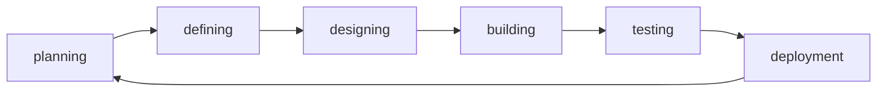
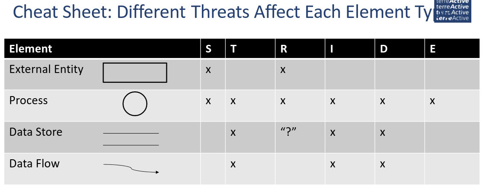

# SPRG

Security is the process to ensure our safety.

## Administratives

### Templates

-   SW02 s.119

### MEP

-   type of exam TBD

### Testat

-   Threat analysis

### Resources

-   [ISSS](https://www.isss.ch/de/)
-   [SANS](https://www.sans.org)
-   [ISC2](https://www.isc2.org)

## Inhalt

### Data flow diagramm

4 elements:

### Approach

Rule of thumb:

-   the effort spent for RE should be inverse to the risk that your're able to manage

### Requirements

#### What is a requirement?

1. A condtion or capability needed by a user to solve a problem or achieve an objective
2. A condition or capability that must be met or possessed by a system or system component to satisfy a contract, standard, specification, or other formally omposed document
3. A documented representation of a condition or capability as in (1) or (2)

#### Functional / Non-Functional requirements

Non-functional requirements are mostly defined by: without this requirement, the base functionality for the user should still be the same but it isn't as smooth/secure/clean or whatever (luxury functions).

### Core Activities of RE

1. **Elicitation**: optain requirements from stakeholders and other sources, refine the requirements in greater detail
2. **Documentation**: elicited requirements are described adequately
3. **Validation and negitiation**: documented requirements must be validated and negotiated early on
4. **Management:** structure requirements, prepare them so they can be used in many roles.

### Boundaries

#### Exercise - Draw a System

see slides SW02

#### How to "find" requirements?

1. Elicitation
    - Documentation
    - validation and negotiation
2. Management

**Elicitation**:

-   List and analyze stakeholders
    -   Who is the customer?
    -   Who are the users?
    -   Who are the deciders?
    -   External systems or organiztions involved?
    -   Regulatory constraints/requirements?
-   Stakeholder Map

**Stakeholder:**

-   Stakeholders:
    -   Consumers
    -   Buyers
    -   The ones with money
-   Examine the individual needs of the different stakeholders

### Brainstorming technique

6-3-5

-   6 people
-   3 suggestions
-   5 minutes

### Questions

-   open
    -   Was für langfristige Ziele haben sie mit dem Produkt (z.B. Weiterentwicklung, Support für Kunden)
    -   Was würden Sie ändern?
-   closed
    -   Maximales Budget
    -   Dimensionen
    -   Welche Zielgruppe

#### Use case exercise

| Description        | Example           |
| ------------------ | ----------------- |
| Use Case Name      | pour coffee       |
| Use Cases          | pour coffee       |
| System             | coffee machine    |
| Akteur             | user              |
| Trigger            | button press      |
| Success Guarantees | hot coffee in cup |

### Models

#### Waterfall

-   Strict linear
-   simple definition of milestones
-   little freedom for developers

#### Agile Software Development

**Core description**:

-   Individuals and interactions over processes and tools
-   Working software over comprehensive documentation
-   Customer collaboration over contrract negotiation
-   Responding to change over following a plan

-   Reuse existing resources multiple times
-   keep it small and simple
-   collective code ownership
-   functional and customer-oriented

Deliver your product in pieces, present your process to the client -> faster reaction if sth isn't how the client wants it.

### Software development life cycle (SDLC)

Also known as software development process.

### Security Testing Principles

-   Confidentiality
-   Integrity
-   Authentication
-   Authorization
-   Availability
-   Non-repudiation

### STRIDE

A framework for analyzing cyber security threats.

-   **S**poofing
-   **T**ampering: Refers to the ability of an attacker to modify or alter data or code within a system or application.
-   **R**epudiation: Refers to the ability of an attacker to deny their involvement or actions within a system or application.
-   **I**nformation disclosure: Refers to the ability of an attacker to access sensitive information that they should not have access to.
-   **D**enial of service
-   **E**levation of privilege

### DREAD

A methology for risk rating

-   **D**amage - how bad would an attack be
-   **R**eproducability - how easy is it to reproduce the attack
-   **E**xploitability - how much work is it to launch the attack
-   **A**ffected users - how many people will be impacted
-   **D**iscoverability - how easy is it to discover the threat

DREAD rating is giving every 'character' a rating from 1-3, adding the numbers together and evaluate:

| Naming | Points |
| ------ | ------ |
| High   | 12-15  |
| Medium | 8-11   |
| Low    | 5-7    |

Example:

| Threat        | D   | R   | E   | A   | D   | Total | Level |
| ------------- | --- | --- | --- | --- | --- | ----- | ----- |
| SQL Injection | 3   | 3   | 3   | 3   | 2   | 14    | High  |

### Mitigate

**Inventing Mitigation is hard**

-   Mitigations are an area of expertise, such as networking, databases or cryptography
-   Amateurs make mistakes, but so do pros
-   Mitigation failures may appear to work... until they don't...
-   When you need to invent mitigations, get expert support
-   Always write a detailed Threat Model (protocol, port, everything you found out)

#### Cheat Sheet: different threats in DFD

#### How to address threats

4 ways to address threats

1. Redesign to eliminate
2. Appliy standard mitigations
    - what has worked for similar software packages
3. Invent new mitigations (riskier)
4. Accept vulnerability in design
    - Example: using closed source OS
    - Can be covered by insurance

### Attack Trees

Visualize a threat and the possibilities on how to execute it, including some details like price and effort.

-   Steal customer data
    -   obtain backup media
    -   intercept email
        -   bribe admin at ISP
        -   hack remote user's home system
        -   hack SMTP gateway
    -   Hack into fileserver
        -   hack through firewall into internal network

### Interfaces as Special Problems

Why are systems vulnerable?

-   independant developed components
-   input data
-   exchange data

Components need interfaces

-   The rules for the input data
-   define a language
-   the language must be defined exactly
-   must be interpreted the same way on both sides

Everything should be defined as detailed as possible, everything has to be checked at runtime.

### Injection

Untrusted input gets processed as code.

-   SQL
-   OS command
-   LDAP query
-   XPath query (for XML)
-   HTTP or File requests
-   JavaScript injection (XSS)

#### Types of Injection

-   1st order injection
    -   in-band: results directly returned through same channel (SQL)
    -   inferential (blind): results returned through a different channel (e.g. error message)
    -   Out-of-band: results returned through a different channel (e.g. email)
-   2nd order injection
    -   Attacker doees not send the malicious payload directly to the target system, but to an intermediate system first.
    -   Example: inject js code into into a form, it is written to a log file, admin opens log file, js code gets executed.
-   Lateral injection - Datentypen werden verändert

#### Prevent Injections

-   Input validation (block stuff)
-   Sanitization (search and remove (possibly dangerous) stuff)
-   Encoding
-   Least privilege principle
-   Optimize SQL Database configuration
    -   Disable non-standard functions on database (e.g. sleep)

### Cross-Site Scripting (XSS)

-   Exploits vulnerabilities in a web application to inject malicious code into the application (Javascript)
-   The malicious code is then executed by the victim's browser (privileges of the user)

Goals:

-   Forward sensitive data to malicious server
-   Force download of malicious files
-   Download additional malicious scripts from attacker's server
-   Session hijacking
-   Overcome CSRF proections
-   Keylogger

Three (common) attack possibilities

1. Document sink - updates DOM of document.element with data controlled by the attacker
2. Location sink - zodates document.location with data controlled by the attacker
3. Execution sink - runs the eval() function with data controlled by the attacker

#### Prevent XSS

-   Frameworks: JSP, JSF, Angular
-   Input validation
-   Don't do your own validation
